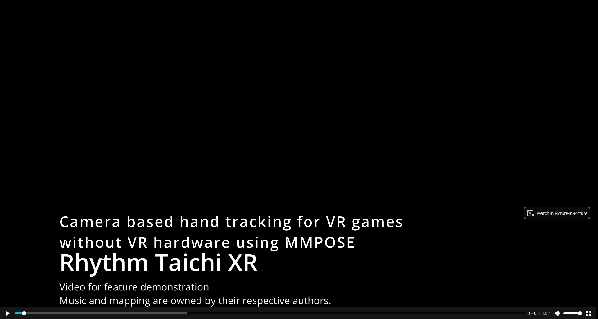

# Brickbuilder XR & Rhythm Taichi XR: Camera based hand tracking for VR games without VR hardware using MMPOSE
## Contest entry for "Infinity Pose" MMPose Demo Competition from Tempstudio

English | [简体中文](/README_zh.md)  
&nbsp;


# Running Brickbuilder XR (Hand demo)

[](https://raw.githubusercontent.com/tempstudio/mmpose-contest-brickbuilder-xr/main/video/Brickbuilder%20XR%20HD.mp4) 

## Install MMCV and MMDetection

```shell
pip install openmim
mim install mmcv-full
pip install mmdet
```

## Install MMPose

```shell
cd ..
git clone clone https://github.com/open-mmlab/mmpose.git
cd mmpose
pip install -e .
```

## Install Unity 

https://unity3d.com/get-unity/download/archive  
The demo uses Unity 2021.1.13f1.  
Open the Unity project.

## Configure camera and IP's

2 cameras are required for the demo.  
Use your phone as IP Camera if you don't have enough USB cameras. (Demo uses wsl - so both cameras are ip cameras.)  
Change the camera_id fields of the below configs to match the camera configurations.  

configs\examples\pose_estimation\pose_estimation.py  
configs\examples\pose_estimation\pose_estimation_2.py

```
camera_id="http://192.168.31.129:9002/video", // <-- Replace with your camera(s)
```

Configure the UDP nodes to send to the correct destination IP. (IP of host running Unity program)

```
        dict(type='UdpSenderNode',
             name='udp_sender',
             enable=True,
             ip='192.168.31.1',       // <-- Replace with the IP of the host running Unity.
                                      // If WSL2: it is the output of "cat /etc/resolv.conf" under linux.
                                      // Also, turn off windows firewall.
```


## Configure camera

Open Unity and ensure the position, rotation and FOV of the 2 tracking cameras matches the respective paramters of the real world cameras.

Ensure the real world cameras are set reasonably apart and cover the center of the play area.

  


## Run the Demo

```shell
python run_hand_demo.py --config configs/examples/pose_estimation/pose_estimation.py &
python run_hand_demo.py --config configs/examples/pose_estimation/pose_estimation_2.py
```

Click "play" in Unity.

\
&nbsp;

# Running Rhythm Taichi XR

[](https://raw.githubusercontent.com/tempstudio/mmpose-contest-brickbuilder-xr/main/video/Rhythm%20Taichi%20XR%201%20HD.mp4) 
[](https://raw.githubusercontent.com/tempstudio/mmpose-contest-brickbuilder-xr/main/video/Rhythm%20Taichi%20XR%202.mp4)

## Install MMCV and MMDetection

```shell
pip install openmim
mim install mmcv-full
pip install mmdet
```

## Install MMPose

```shell
cd ..
git clone clone https://github.com/open-mmlab/mmpose.git
cd mmpose
pip install -e .
```

## Install Rhythm Taichi

Download the game here: https://tempstudio.itch.io/rhythm-taichi


## Configure camera and IP's

It is recommended to use a mobile phone as camera for higher performance. If using a webcam, make sure it can deliver at least constant 30 FPS.    
(Many built-in webcams drop to 15FPS when the image changes quickly, which is not enough for this game).  

The demo video uses the "IP Webcam" android application with these settings:   
```
Resolution 352 x 288   
Quality 25  
Orientation Landscape  
Max FPS 45   
```

If your computer cannot run inference fast enough, reduce video FPS until the video no longer lags behind.   
The demo is ran with RTX 3080 mobile with WSL2.   
CUDA is practically required, but a reasonably modern GPU should be able to run this under linux native.   

Edit configurations to send to correct IP's:  
configs/examples/pose_estimation/rhythm_taichi.py

```

camera_id="http://192.168.31.129:9002/video",  // <-- Replace with your camera
server_ip = '172.19.96.1',                     // <-- Replace with ip of host running the game
                                               // If WSL2: it is the output of "cat /etc/resolv.conf" under linux.
                                               // Also, turn off windows firewall.

```


## Run the Demo

Start the game first (Rhythm Taichi.exe). It will stay on title screen and prompt for phone connection.
Start the webcam app.

With both of the above started, run the demo script

```shell
python run_rhythm_taichi.py --config configs/examples/pose_estimation/rhythm_taichi.py
```

The game should load into the menu. If it is the first time launching the game, it will try to install songs. Click "Skip".    
(If you have not previously played the game, it is recommended that you play it on Android first to understand how it works.)   
Download some songs from the "Get more songs" tab.  


Cover the camera for now and use mouse to navigate the menu.  
Once downloaded, select the song and click "Play".
\
&nbsp;


# Tech report

The demo(s) work roughly as follows:
* Use MMPOSE to collect 2D hand / body pose 
* Send them over UDP to Unity
* Consume the keypoint data in Unity to reconstruct hand or finger positions

\
&nbsp;

