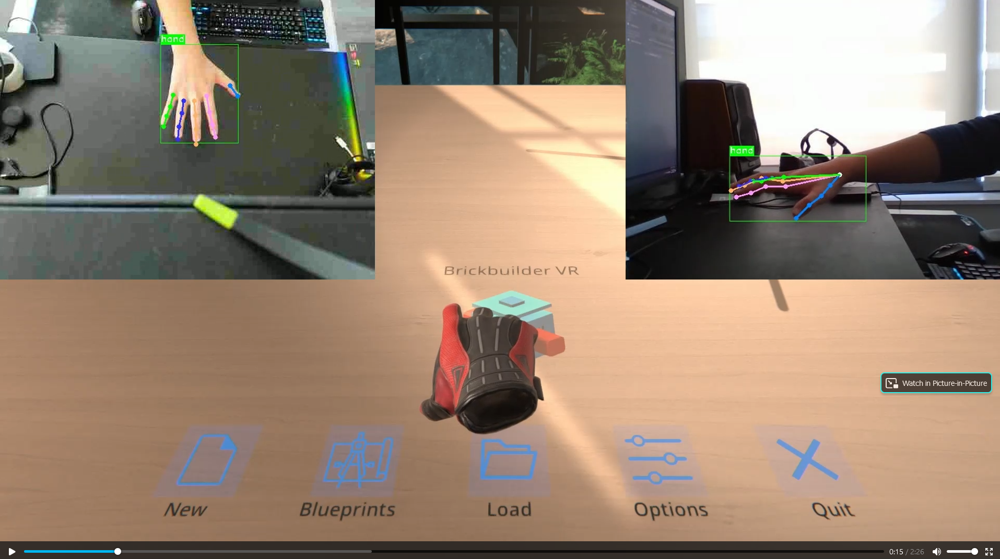
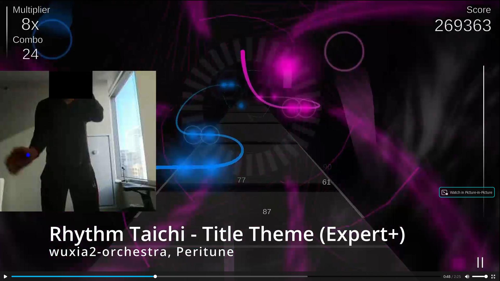

# 搭砖块XR / 节奏太极XR：通过MMPOSE和姿态估计实现体感游戏
## Tempstudio “万物生姿 MMPose 姿态估计创意 Demo 大赛” 参赛项目
[English](/README.md) | 简体中文
&nbsp;


# 搭砖块XR (手部姿态演示)

[](https://raw.githubusercontent.com/tempstudio/mmpose-contest-brickbuilder-xr/main/video/Brickbuilder%20XR%20HD.mp4) 
注：代码只包括手势同步，不包括游戏本身。  

## 安装 MMCV 和 MMDetection

```shell
pip install openmim
mim install mmcv-full
pip install mmdet
```

## 安装 MMPose

```shell
cd ..
git clone https://github.com/open-mmlab/mmpose.git
cd mmpose
pip install -e .
```

## 安装 Unity 

https://unity3d.com/get-unity/download/archive  
项目使用 Unity 2021.1.13f1.  
打开“Unity” 文件夹

## 设置摄像头和IP

这个项目需要2个摄像头。   
必须的情况下，可以使用手机作为远程摄像头 (mjpeg) (目前的参数使用wsl，所以2个摄像头都是远程。)   
分别修改以下2个文件：

configs\examples\pose_estimation\pose_estimation.py    
configs\examples\pose_estimation\pose_estimation_2.py  

```
camera_id="http://192.168.31.129:9002/video", // <-- 改成正确的摄像头ID或者URL
```

设置 UDPSenderNode 的目标IP地址 (运行Unity的主机IP）  

```
        dict(type='UdpSenderNode',
             name='udp_sender',
             enable=True,
             ip='192.168.31.1',       // <-- 改成Unity的主机IP
                                      // 在WSL2下，这个IP可以通过 "cat /etc/resolv.conf" 获得
                                      // 此外，可能还需要关闭Windows防火墙。
```


## 设置Unity下的摄像头位置

在 Unity 里，确保 "tracking camera" 的 position, rotation 和 FOV 与2个现实中的摄像头一致。  
2个摄像头最好保持一定的距离，并且从不同的角度对准操作区域。   

  


## 运行

```shell
python run_hand_demo.py --config configs/examples/pose_estimation/pose_estimation.py &
python run_hand_demo.py --config configs/examples/pose_estimation/pose_estimation_2.py
```

在Unity中点“Play”。

\
&nbsp;

# 节奏太极XR

[](https://raw.githubusercontent.com/tempstudio/mmpose-contest-brickbuilder-xr/main/video/Rhythm%20Taichi%20XR%201%20HD.mp4) 
[](https://raw.githubusercontent.com/tempstudio/mmpose-contest-brickbuilder-xr/main/video/Rhythm%20Taichi%20XR%202.mp4)


## 安装 MMCV 和 MMDetection

```shell
pip install openmim
mim install mmcv-full
pip install mmdet
```

## 安装 MMPose

```shell
cd ..
git clone https://github.com/open-mmlab/mmpose.git
cd mmpose
pip install -e .
```

## 安装 节奏太极

下载地址: https://tempstudio.itch.io/rhythm-taichi


## 设置摄像头和IP

推荐使用手机作为远程摄像头。如果使用电脑内置的，请确保它能稳定传输30FPS。  
(很多内置摄像头在画面快速变化的时候会掉到15FPS。15FPS基本上就不能玩了)  

演示视频是通过安卓上 "IP Webcam" app 录制的。具体设置如下：

```
Resolution 352 x 288   
Quality 25  
Orientation Landscape  
Max FPS 45   
```

如果电脑的处理速度不能和摄像头保持同步，请降低摄像头的帧数，直到电脑上的延迟消失为止。    
（反过来说，如果你的设备性能更强，可以设置更高的FPS或者使用精度更高的模型）  
上面的设置针对的是WSL2，CUDA，RTX 3080 Mobile。

按照如下修改参数文件：  
configs/examples/pose_estimation/rhythm_taichi.py

```

camera_id="http://192.168.31.129:9002/video",  // <-- 改成正确的摄像头ID或者URL
server_ip = '172.19.96.1',                     // <-- 改成运行游戏的电脑IP
                                               // 在WSL2下，这个IP可以通过 "cat /etc/resolv.conf" 获得
                                               // 此外，可能还需要关闭Windows防火墙。

```


## 开始游戏

先启动Rhythm Taichi.exe，游戏会在主界面提示需要连接手机。  
然后打开摄像头 (IP Webcam)    

以上准备完毕之后，可以执行脚本了：   

```shell
python run_rhythm_taichi.py --config configs/examples/pose_estimation/rhythm_taichi.py
```

游戏在连接成功之后会进入主菜单。如果之前没有玩过，它会试着安装歌曲，点击"Skip"跳过。  
(这里推荐在安卓上下载Rhythm Taichi过一下教程。)

操作菜单需要使用鼠标，这时需要把摄像头挡住避免干扰。点击 "Get more songs" 来下载歌曲，之后就可以选歌启动游戏了。  
\
&nbsp;


# 技术说明

两个演示是通过同样的技术实现的：
* 通过MMPOSE获取的关节位置
* 通过UDP传输到Unity中
* 在Unity中使用手部坐标实现游戏交互

\
&nbsp;

